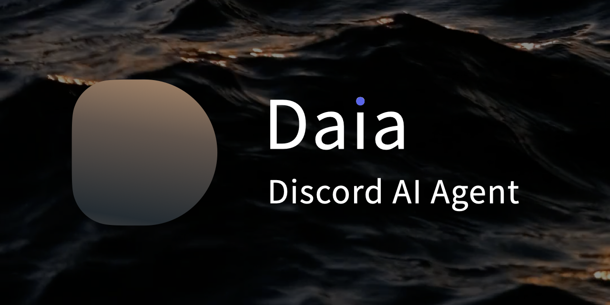
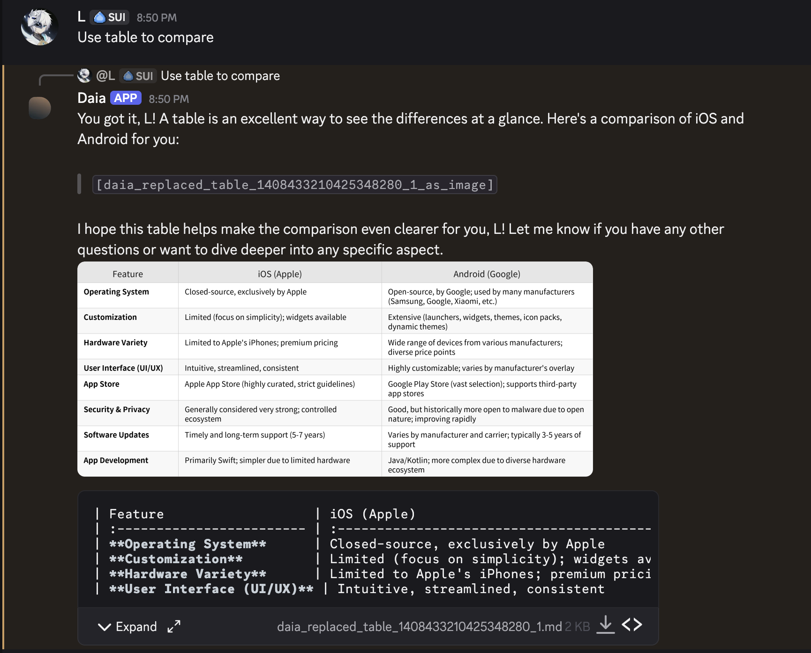

<p align="center">
  
</p>

<p align="center">
    <a href="LICENSE"></a>
    
    <a href="https://github.com/zhiro-labs/daia/actions/workflows/ci.yml"></a>
    <a href="https://github.com/zhiro-labs/daia/actions/workflows/test-matrix.yml"></a>
</p>

Daia (Discord AI Agent) is an intelligent Discord bot powered by Google Gemini and built on the [PocketFlow](https://github.com/The-Pocket/PocketFlow) framework. It provides conversational AI capabilities with advanced features like markdown table rendering, message history processing, and Google Search integration.

## Features

- **AI-Powered Conversations**: Leverages Google Gemini for natural language understanding and generation.
- **User Recognition**: Recognizes and addresses users by their display name for a personalized experience.
- **Smart Message Processing**: Processes Discord message history with context awareness.
- **Markdown Table Rendering**: Automatically converts markdown tables to images using Noto Sans CJK fonts. Supported languages include but are not limited to English, Simplified Chinese (简体中文), Traditional Chinese (繁體中文), Japanese (日本語), and Korean (한국어).
  <p align="center">
    
  </p>
- **Smart Chunking**: Automatically splits long messages into smaller chunks, preserving markdown formatting to avoid Discord's character limit.
- **Google Search Integration**: Built-in search capabilities through Gemini tools.
- **Slash Commands**: Includes a `/newchat` command for starting fresh conversation sessions.

## Getting Started

### Prerequisites

- A Discord Bot Token. You can follow the official guide to create one: [Discord Developer Documentation](https://discord.com/developers/docs/quick-start/getting-started#step-1-creating-an-app).
- A Google Gemini API Key. You can obtain one from [Google AI Studio](https://aistudio.google.com/apikey).

### Environment

This project requires Python 3.12+. `uv` will gracefully handle the Python version requirement, create a virtual environment, and manage all project dependencies for you.

### Installation

1.  **Clone the repository:**

    ```bash
    git clone https://github.com/zhiro-labs/daia.git
    cd daia
    ```

2.  **Install dependencies:**

    ```bash
    uv sync
    ```

    > ℹ️ **Note:**
    > If you don't have `uv` installed, you can follow the official installation guide: [https://docs.astral.sh/uv/getting-started/installation/](https://docs.astral.sh/uv/getting-started/installation/)

3.  **Configure your environment and system prompt:**

    - Copy the example files to create your own configuration:
      ```bash
      cp .env.example .env
      cp config/chat_sys_prompt.txt.example config/chat_sys_prompt.txt
      ```
    - Edit the `.env` file to add your Discord bot token and Gemini API key.
    - Edit `config/chat_sys_prompt.txt` to customize the bot's personality and instructions.

4.  **Run the bot:**
    ```bash
    uv run main.py
    ```
    > ℹ️ **Note:**
    > On first run, the bot will automatically download Noto CJK fonts (~100MB) for high-quality table image rendering. This may take a few minutes depending on your internet connection.

## Discord Application Permissions and Intents

For the bot to function correctly, you need to configure its permissions and intents in the [Discord Developer Portal](https://discord.com/developers/).

### Privileged Gateway Intents

Navigate to your bot's settings in the Discord Developer Portal and enable the following privileged gateway intents:

- **Server Members Intent**: Required for the bot to recognize and address users by their display name.
- **Message Content Intent**: Required for the bot to read message content.

### Bot Permissions

When inviting the bot to your server, ensure it has the following permissions:

- **General Permissions**
  - View Channels
- **Text Permissions**
  - Send Messages
  - Attach Files
  - Read Message History

## Configuration

Daia is configured using environment variables. These can be set in a `.env` file in the project root.

- `DISCORD_BOT_TOKEN`: Your Discord bot token. **(Required)**
- `DISCORD_BOT_ACTIVITY`: The activity status displayed for the bot (e.g., "Surfing", "Listening to music"). Optional.
- `ALLOWED_CHANNELS`: A comma-separated list of channel IDs where the bot is allowed to respond without being mentioned. If this is not set, the bot will only respond to direct messages and mentions.
- `HISTORY_LIMIT`: The maximum number of messages to fetch from the channel history. **(Required)**
- `GEMINI_API_KEY`: Your Google Gemini API key. **(Required)**
- `CHAT_MODEL`: The Gemini model to use (e.g., "gemini-1.5-flash", "gemini-1.5-pro"). **(Required)**
- `CHAT_TEMPERATURE`: Controls the randomness of Gemini's responses (range: 0.0–2.0). **(Required)**
- `CHAT_SYS_PROMPT_PATH`: The path to the system prompt file. **(Required)**
- `ENABLE_CONTEXTUAL_SYSTEM_PROMPT`: Set to `on` to enable the contextual system prompt, which allows the bot to recognize and address users by their display name. The recommended setting is `on` (as set in `.env.example`). If the variable is not set, it defaults to `off`.
- `LLM_PROVIDER`: The LLM provider to use. Currently supports `gemini`. Defaults to `gemini`.

## Usage

Daia is designed for easy interaction. Here's how you can use its features:

- **Start a Conversation**: To begin interacting with Daia, you have several options:
  - **In allowed channels**: If `ALLOWED_CHANNELS` is configured with specific channel IDs, you can directly send messages in those channels without mentioning the bot.
  - **Mention the bot**: In any channel where the bot has access, mention it (e.g., `@Daia hello!`) to start a conversation.
  - **Direct Message**: Send the bot a Direct Message (DM) to chat privately.

- **Continue the Conversation**: Daia remembers the recent conversation history. You can simply send a new message to continue the conversation without needing to mention the bot again.

- **Start a New Chat Session**: To start a fresh conversation and clear the context, use the `/newchat` slash command. This will make the bot forget the previous conversation history in that channel.

- **Automatic Table Rendering**: When Daia's response contains a markdown table, it will automatically be rendered as an image for better readability. This feature works automatically without any specific commands.

- **Google Search**: If you ask a question that requires up-to-date information, Daia will automatically use its Google Search tool to find the answer.

- **Long Message Handling**: Daia automatically splits long messages into multiple smaller ones, preserving the original formatting. This is an automatic feature to work around Discord's character limit.

## Development

### Setting Up Development Environment

For development work, you'll need the development dependencies which include testing and linting tools:

```bash
# Install all dependencies including dev tools
uv sync --dev
```

This installs both production dependencies and development tools like `pytest`, `ruff`, and `pre-commit`.

### Makefile Commands

This project includes a Makefile with convenient shortcuts for common development tasks:

```bash
make help          # Show all available commands
make install       # Install dependencies with uv (includes --dev flag)
make test          # Run tests with pytest
make lint          # Check code quality with ruff
make format        # Auto-format code with ruff
make format-check  # Check if code is properly formatted
make clean         # Remove Python cache files
make ci            # Run all CI checks locally (lint + format-check + test)
make all           # Complete workflow (install + lint + format + test)
```

### Development Workflow

1. **Before making changes:**
   ```bash
   make install  # Ensure all dependencies are up to date
   ```

2. **During development:**
   ```bash
   make format   # Auto-format your code
   make lint     # Check for code quality issues
   make test     # Run the test suite
   ```

3. **Before committing:**
   ```bash
   make ci       # Run all checks (same as GitHub Actions)
   ```

The `make ci` command runs the same checks as your GitHub Actions CI, allowing you to catch issues locally before pushing. This saves time by avoiding failed CI runs.

### Troubleshooting CI Failures

If your CI fails or you encounter linting issues:

1. **Check what's wrong locally:**
   ```bash
   make lint          # See specific linting errors
   make format-check  # Check formatting issues
   ```

2. **Fix automatically:**
   ```bash
   make format        # Auto-fix most formatting issues
   ```

3. **Verify the fix:**
   ```bash
   make ci           # Ensure all checks pass before pushing
   ```

### Code Quality Tools

- **Ruff**: Fast Python linter and formatter that handles code style, imports, and common issues
- **Pytest**: Testing framework for running the test suite
- **Pre-commit**: Git hooks that run checks before commits (if configured)

## Project Structure

```
.
├── .env.example
├── .gitignore
├── main.py
├── pyproject.toml
├── README.md
├── Makefile
├── nodes/
│   ├── __init__.py
│   ├── contextual_system_prompt.py
│   ├── fetch_history.py
│   ├── llm_chat.py
│   ├── process_history.py
│   ├── send_response.py
│   ├── table_extractor.py
│   └── table_renderer.py
├── utils/
│   ├── __init__.py
│   ├── config_utils.py
│   ├── discord_helpers.py
│   └── download_font.py
└── ...
```

## Contributing

Contributions are welcome! Please feel free to submit a pull request or open an issue.

## Todo

### Core Features

- [ ] Reply message rearrange
- [ ] Timezone setting
- [ ] daia-ignore tag
- [ ] Image processing
- [ ] YouTube processing
- [ ] Deep search
- [ ] Smart reply channels
- [ ] Gemini safety setting

### Extensibility

- [ ] MCP support
- [ ] OpenAI support
- [ ] OpenAI compatible support
- [ ] Database support
- [ ] Long-term memory
- [ ] Dive deeper cookbook/pocketflow-thinking on [PocketFlow](https://github.com/The-Pocket/PocketFlow)

## Acknowledgments

- Inspired by [PocketFlow](https://github.com/The-Pocket/PocketFlow) by [Zachary Huang](https://github.com/zachary62)
- The cover background photo was shot by [Çağrı KANMAZ](https://www.pexels.com/@cagrikanmaz) on [Pexels](https://www.pexels.com/video/33098418/)
