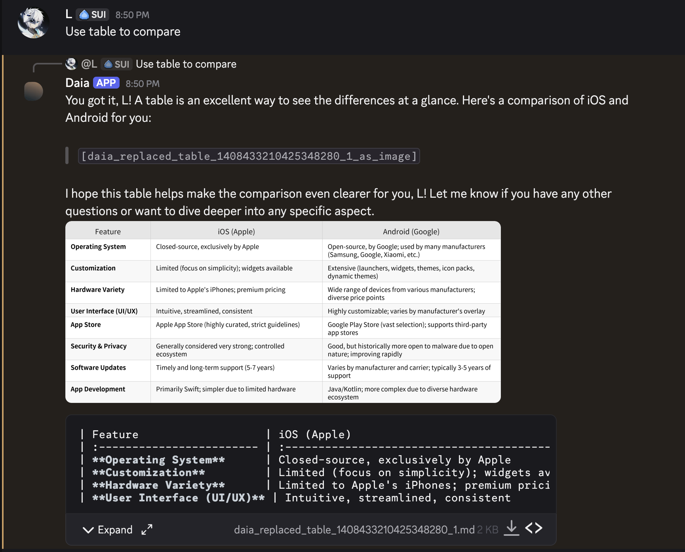

## Environment Variables (`.env`)
| Variable | Required | Description |
|----------|----------|-------------|
| `DISCORD_BOT_TOKEN` | Yes | Bot token |
| `CHAT_MODEL_API_KEY` | Yes | Gemini API key |
| `CHAT_MODEL` | Yes | e.g., `gemini-1.5-flash` |
| `CHAT_TEMPERATURE` | Yes | 0.0–2.0 |
| `HISTORY_LIMIT` | Yes | Max history messages |
| `CHAT_SYS_PROMPT_PATH` | Yes | Path to system prompt |
| `ALLOWED_CHANNELS` | No | Comma-separated channel IDs |
| `ENABLE_CONTEXTUAL_SYSTEM_PROMPT` | No | `on` to address users by name (recommended) |

## How to Chat
- In allowed channels: just type
- Anywhere: mention `@Daia`
- DM the bot for private chat

Daia remembers recent messages.

## Slash Commands
- `/newchat` → start fresh conversation

## Advanced Features
- **Tables** → automatically rendered as images
  
- **Long replies** → split while keeping formatting
- **Google Search** → used automatically when needed
- **User recognition** → enabled with `ENABLE_CONTEXTUAL_SYSTEM_PROMPT=on`

## Development (optional)
```bash
git checkout dev
uv sync --dev
make help      # see all commands
make ci        # run lint + tests locally
```
