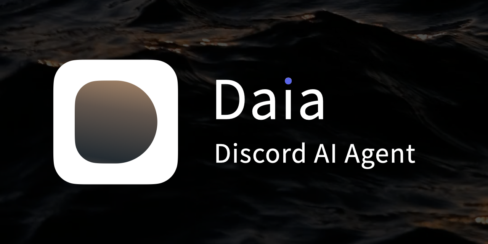

# Daia: Discord AI Agent
{: .no_toc }



[](https://github.com/zhiro-labs/daia/blob/main/LICENSE)

[](https://github.com/zhiro-labs/daia/actions/workflows/ci.yml)
[](https://github.com/zhiro-labs/daia/actions/workflows/test-matrix.yml)

**Daia** (Discord AI Agent) is an intelligent Discord bot optimized for **Google Gemini** and built on the **[PocketFlow](https://github.com/The-Pocket/PocketFlow)** framework. It brings conversational AI capabilities with advanced features like markdown table rendering, message history processing, and Google Search integration directly into your Discord server.

---

## Table of Contents
{: .no_toc .text-delta }

1. TOC
{:toc}

---

## Overview

Daia transforms your Discord server into an intelligent conversational space. Whether you need quick answers, data visualization, or just a friendly chat, Daia leverages the power of Google's Gemini AI to provide natural, context-aware responses.

Built on the PocketFlow framework, Daia is designed to be extensible, maintainable, and easy to deploy.

## Key Features

### 🤖 AI-Powered Conversations
Leverages Google Gemini for natural language understanding and generation. Daia can engage in meaningful conversations, answer questions, and provide helpful information across a wide range of topics.

### 👤 User Recognition
Recognizes and addresses users by their Discord display name for a personalized experience. Enable this feature with `ENABLE_CONTEXTUAL_SYSTEM_PROMPT=on` in your configuration.

### 📊 Markdown Table Rendering
Automatically converts markdown tables to beautifully rendered images using Noto Sans CJK fonts. Supports multiple languages including:
- English
- Simplified Chinese (简体中文)
- Traditional Chinese (繁體中文)
- Japanese (日本語)
- Korean (한국어)


### ✂️ Smart Message Chunking
Automatically splits long messages into smaller chunks while preserving markdown formatting. This ensures responses stay within Discord's character limit without breaking code blocks or formatting.

### 🔍 Google Search Integration
Built-in search capabilities through Gemini tools. When Daia needs up-to-date information, it can automatically search the web to provide accurate answers.

### 💬 Slash Commands
Includes a `/newchat` command for starting fresh conversation sessions, clearing the context and beginning anew.

### 📝 Context-Aware History
Processes Discord message history with context awareness, allowing Daia to understand the flow of conversation and provide relevant responses.

## Quick Start

Get Daia up and running in minutes:

```bash
# Clone the repository
git clone https://github.com/zhiro-labs/daia.git
cd daia

# Install dependencies
uv sync

# Configure
cp .env.example .env
cp config/chat_sys_prompt.txt.example config/chat_sys_prompt.txt
# Edit .env with your tokens

# Run
uv run main.py
```

See the [Getting Started](getting-started.html) guide for detailed instructions.

## Use Cases

- **Community Support**: Answer common questions automatically
- **Data Visualization**: Present data in easy-to-read table formats
- **Information Lookup**: Search and retrieve up-to-date information
- **Casual Conversation**: Engage with community members naturally
- **Multilingual Support**: Communicate in multiple languages with proper rendering

## Architecture

Daia is built on PocketFlow, a workflow framework that makes it easy to create modular, maintainable AI applications. The bot's functionality is organized into nodes that handle specific tasks:

- **Fetch History**: Retrieves message history from Discord
- **Process History**: Formats messages for the AI model
- **Contextual System Prompt**: Adds user context to prompts
- **LLM Chat**: Interfaces with Google Gemini
- **Table Extractor**: Identifies markdown tables in responses
- **Table Renderer**: Converts tables to images
- **Send Response**: Delivers messages back to Discord

## Requirements

- Python 3.12 or higher
- Discord Bot Token ([Get one here](https://discord.com/developers/applications))
- Google Gemini API Key ([Get one here](https://aistudio.google.com/apikey))

## Community & Support

- **GitHub**: [zhiro-labs/daia](https://github.com/zhiro-labs/daia)
- **Issues**: [Report bugs or request features](https://github.com/zhiro-labs/daia/issues)
- **Discussions**: [Join the conversation](https://github.com/zhiro-labs/daia/discussions)

## License

Daia is open source software licensed under the [MIT License](https://github.com/zhiro-labs/daia/blob/main/LICENSE).

## Acknowledgments

- Built with [PocketFlow](https://github.com/The-Pocket/PocketFlow) by [Zachary Huang](https://github.com/zachary62)
- Cover background photo by [Çağrı KANMAZ](https://www.pexels.com/@cagrikanmaz) on [Pexels](https://www.pexels.com/video/33098418/)
